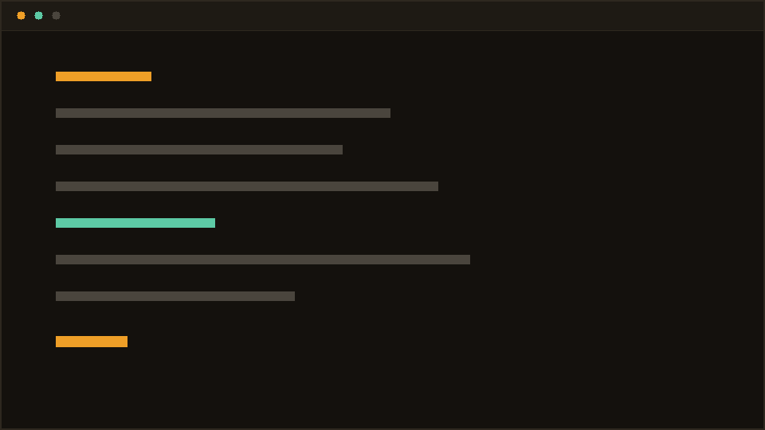

# rv-cli

The Terminal You are reading this in.

**What It is.** A SvelteKit App wrapped around xterm.js, served from Cloudflare
as static Assets. The Filesystem You are browsing is generated at Build time
from a Folder of Markdown Files, so adding a Post means pushing a `.md` and
nothing else. There is no Backend at all — every Command You can type runs in
Your own Browser.

**What I cut.** This had an AI Agent for a while — `ama <Question>`, streaming
Answers out of Workers AI. I removed It. Nobody visits a Portfolio hoping to
talk to a Chatbot, and I did not like that a Stranger's Question about Me would
be answered by a Model guessing on My Behalf. It was also the only Reason the
Site needed a Database, a KV Store and a Rate Limiter, all of which went with It.

**What I would change.** The Mobile Fallback drops the Terminal Metaphor
entirely, which I still feel slightly guilty about. Screenshots draw inline
through the iTerm Image Protocol, which is the kind of Detail nobody asks for
and I could not resist.

Source: [github.com/Leung-Arvin/rv-cli](https://github.com/Leung-Arvin/rv-cli)
